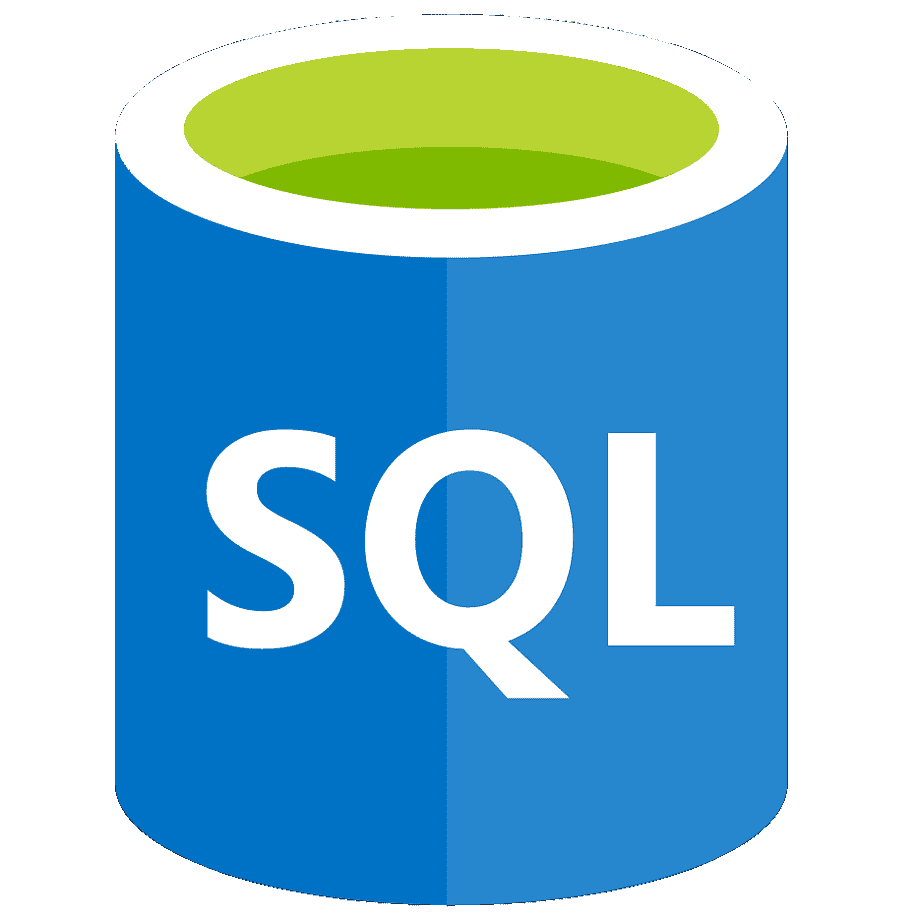

## Olá! 😁

✨ Depois de mais de 17 anos atuando com Recursos Humanos e Departamento Pessoal, com foco em folha de pagamento, eSocial, encargos, auditorias e outros processos, decidi dar um novo passo na minha carreira e mergulhar no universo da Análise de Dados! 

.

📜 **Principais Ferramentas:**

  
  
  

.

🛠️ **Em estudo:**

Phyton para Análise de Dados - Comunidade Bruce Fonseca

MBA em Análise de Dados - Faculdade Anhanguera

.

🤓 **Idiomas:**

Espanhol - Básico/Intermediário

Inglês - Básico
